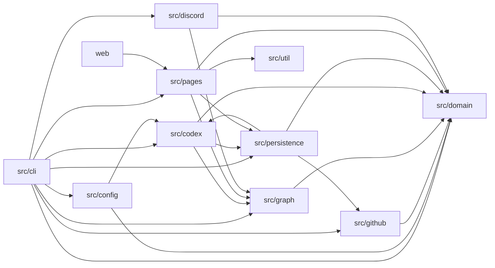

# アーキテクチャ

VOICEVOX Task Trackerは、GitHubから得た確定情報を決定論的に評価し、未回答の依頼やIssue全体の実質担当のような曖昧な自然言語だけをCodexで補う日次バッチです。
結果は型付き依存グラフと追跡stateへ集約し、GitHub PagesとDiscord向けの公開データへ変換します。

## モジュール境界

| モジュール        | 責務                                                                                             | 主な依存先                                               |
| ----------------- | ------------------------------------------------------------------------------------------------ | -------------------------------------------------------- |
| `src/config`      | YAMLの読み込み、Zod schemaとsemantic validation                                                  | `src/codex`、`src/domain`、`src/util`                    |
| `src/diagnostics` | 詳細診断のJSONL記録、Error直列化、暗号化、復号                                                   | Node.js標準module                                        |
| `src/github`      | GitHub App認証、RESTとGraphQLの読み取り、公開allowlist、収集、正規化、rate limit管理             | `src/config`、`src/domain`                               |
| `src/domain`      | 状態機械、maintainerとlabel解決、追跡選定、停滞時間、停滞レベル、重要度、要対応度                | `src/util`                                               |
| `src/graph`       | 関係候補抽出、edge reconcile、cycle、frontier、downstream impact                                 | `src/domain`                                             |
| `src/codex`       | 分析候補選定、予算、cache、隔離実行、schemaとsemantic validation、reducer                        | `src/domain`、`src/graph`、`src/persistence`             |
| `src/persistence` | canonical JSON、snapshot、履歴、AI cache、通知管理記録、run report、Git branch transaction       | `src/codex`、`src/domain`、`src/github`                  |
| `src/pages`       | 独立した公開guard、公開DTO生成、gzip上限検査、JSON出力                                           | `src/domain`、`src/graph`、`src/persistence`、`src/util` |
| `src/discord`     | 通知候補選別、通知管理記録による重複抑制、payload分割、mention制限、Webhook送信                  | `src/domain`、`src/graph`                                |
| `src/eval`        | golden fixtureの解析と期待値比較                                                                 | 判定、graph、公開DTO、通知の各pure処理                   |
| `src/performance` | 外部接続をモックした日次run全体の性能と予算の検証                                                | `src/cli`と全実処理モジュール                            |
| `src/cli`         | コマンド解析、日次トランザクション、実アダプターの合成、run report                               | 上記の全モジュール                                       |
| `web`             | 公開DTOの検証、要対応度と重要度を含む一覧と詳細、通知履歴、項目ごとの依存グラフ、検索、deep link | `src/pages`のDTO契約                                     |

`src/domain`と`src/graph`はネットワークとファイルシステムへ依存しません。
副作用を持つモジュールがpureな判定を呼び出し、pureな判定からGitHub、Codex、Git、Pages、Discordを呼び出す逆向きの依存は作りません。
`src/cli`だけが実アダプターを組み合わせて一つのrunにします。



## 日次run

`pnpm tracker:run`はworkflow向けサブコマンドを検証し、変換せず既存CLIへ渡します。
option形式の引数は`--backfill`に従って`daily`または`backfill`へ変換し、`DailyTransactionRunner`へ渡します。
日次トランザクションは次の順で進みます。

1. `config.yml`を検証し、必要な環境変数だけを読み取ります。
2. `tracker-state` branchのsnapshotと通知管理記録を同じrevisionから読み取ります。
3. GitHub Appのinstallation tokenを発行し、期限前に更新できる読み取り専用clientを作ります。
4. Organizationのrepository metadataを全ページ取得し、run中に不変な公開allowlistを作ります。
5. allowlist内repositoryのopen IssueとPull Requestを列挙して詳細を収集します。前回の`aiAnalysis.status`が`failed`か`deferred`の項目は、GitHub側の変化にかかわらず詳細を収集します。個人原因も初回の未計画、計画versionの変更、必要性が残る未評価・失敗・延期で有効な採用値がない場合、terminalになった原因の終了確認を詳細取得へ加えます。AI無効中は個人原因の再試行だけを理由に毎回取得しません。収集した詳細から関係先を抽出し、まだ取得していないOrganization内の関係先を識別子指定で個別列挙して収集結果へ統合します。追加した詳細から関係先を再び抽出し、対象がなくなるまで同じrun内で繰り返します。native relationは設定した深度まで、参照は追跡根から1 hopだけ辿ります。
6. GitHubイベントをsource ID付きに正規化し、追跡対象と関係候補を選びます。Pull Request作成前のcommitは作成時刻を下限としてpushイベント化し、項目作成前のイベントを作りません。
7. `config.yml`の`maintainers`からrepositoryごとのGitHubユーザー名一覧を解決し、IssueとPull Requestの状態と責務を決定論的に判定します。抽象的なmaintainer、reviewer、merge_deciderの責務は、メンテナ1人につき1件の`kind: "user"`候補へ展開します。openかつ未アサインIssueでは、明確な着手宣言、追跡中のPRとのGitHub上で確定したauthoritativeな直接`implements`関係、継続成果物を持つ人間を実質担当候補として`candidates.waitingOn`へ加え、候補IDとsource IDを`deterministicSignals`へ渡します。正式assigneeを解除した場合は解除前のsourceを候補から除きます。 個人催促向けには、block適用前のローカルな状態と責務もIssue・PR双方で判定します。
8. 汎用AIの解釈が必要な要素をCodexで分析し、出力を検証します。未アサインIssueの候補はIssue全体を進めているとhigh以上で判断できる場合だけ既存の`waiting_for_work`へ反映し、推論だけのrelation、部分実装、親・横断Issue、助言、検証、review、条件付き意向、撤回、延期、単なるauthorやcommenterは反映しません。一般的な活動状態の推察と、部分担当や部分実装のモデル化は行いません。前回のAI分析が失敗または延期した項目は、GitHub側の変化にかかわらず分析対象を再選定します。
9. reducerの第1 pass、暫定graphのreconcileと解析、graphを反映したreducerの第2 pass、最終graphのreconcileと解析の順に実行し、停滞時間、cycle、frontier、downstream impactを確定して重要度と要対応度を計算します。
10. 最終graph、収集した項目と詳細、ローカル判定、前回の原因を専用helperへ渡し、原因・根拠・責務範囲・時計を組み立てます。関係や汎用AIの採用で初めて確定した原因も追加・更新し、必要な原因を残予算で意味評価します。
11. 原因ごとの採用結果から現在対応と個人通知候補を作り、snapshot全体の完全性と公開安全性を検証します。system通知は項目全体の確定事実と変化から選びます。
12. `daily`と`backfill`では検証済みstateをatomic commitし、Pages用DTOを書き出して通知処理を実行します。`send`は既存の最大件数と通知管理記録の重複抑制に従ってDiscord送信を行い、`hold`は候補を未送信のまま保存します。`acknowledge-current`は現在の通知条件を満たす候補をreasonごとに上限なしで確認済みとして通知管理記録へ保存します。完了時に実測時刻と処理結果を反映したrun reportと通知管理記録を追加commitし、`send`だけが送信済み通知を日次履歴へ追加します。`tracking.startAt`が未確定なら同じcommitで確定します。
13. 成功、Codex縮退、失敗のいずれでもCLIのreport pathへrun reportを書き出します。

`dry-run`は手順11まで実行し、state、Pages、Discordを変更せずに検証済みartifactとrun reportだけを書き出します。
Codexの失敗は決定論的判定へ縮退できるため、完全性を満たす場合は`fallback`として後続処理を続けます。
snapshotは汎用AIの有効状態、利用可否、縮退状態をrun statusと別に保存します。
`available`は検証済みのAI分析結果を1件以上利用できたことを表します。分析対象がなく失敗も延期もないrunも`available`です。
`degraded`は失敗または延期が1件以上あることを表します。利用できた結果が1件もなければ`available`は`false`になります。
PagesはこのAI状態を公開DTOへ変換し、run statusからAIの状態を推定しません。
個人原因は原因ごとの評価状態を別に保存し、有効な採用値のない失敗・延期をrunの`fallback`へ反映します。正常に完了した`unknown`だけでは縮退にしません。
repository単位の収集は、再試行後も503で失敗し、同じrepositoryの前回値がある場合だけ前回値を`stale`として使います。
この縮退はdiagnosticとstale件数を記録して後続処理を続け、run statusを変更しません。
前回値がない503、503以外の例外、不完全な結果は`failure`となり、通常の後続stageを実行しません。
反復を終えても端点を取得できなかった関係候補は追跡選定へ渡さず、除外した件数をdiagnosticへ記録します。
GitHubの`closingIssuesReferences`とtimelineの`willCloseTarget`はauthoritativeな`implements`関係として確定します。実質担当のPR根拠には、追跡中のPRに対するこの関係だけを使います。
本文のclosing keywordだけから得た`implements`候補は推定のままとし、実質担当の根拠には使いません。
関係先のPRや子Issueで確認した作業者を、親Issueや横断Issueの実質担当者へ拡張しません。

`.github/workflows/daily.yml`は通常経路の`quality-eval`、`collect-analyze`、`persist-state`、初回の`build-pages`、初回の`deploy-pages`、`notify-discord`、通知候補がある場合だけ動く`publish-notification-history`に、失敗時だけ動く`notify-operations`と全job結果を保存する`report-workflow`を加えた9 jobで構成されています。
schema version 12のworkflow artifactは`notificationAction`を保持します。`persist-state`はsnapshotと、未送信候補を含む通知管理記録を同じatomic transactionで保存します。`notify-discord`はartifactと`tracker-state`のsnapshot run IDを照合してから、`send`なら通知を送り、`hold`と`acknowledge-current`なら通常通知を送らずにrunを完了します。不一致の場合は通知もrun完了処理も行いません。`send`で通知候補がある場合だけ`publish-notification-history`が最新stateを取得し、送信済み通知を含むPagesを再生成してdeployします。運用障害通知はこの通知処理と別系統です。
repository variableの`VOICEVOX_TASK_TRACKER_SCHEDULE_PAUSED`が`true`の場合は、定期実行の開始jobと障害通知・run報告を省略します。手動実行には影響しません。
`collect-analyze`は`CODEX_AUTH_JSON`をrunnerの一時directoryへ配置し、配置直後の`auth.json`のsha256を指紋として保存します。
配置直後とsecretへ書き戻す直前に、`auth.json`内のすべての文字列値を行へ分け、16文字以上の各行を`::add-mask::`へ登録します。
値に含まれる`%`はworkflow commandへ渡す前に`%25`へescapeします。
個々のtokenは`CODEX_AUTH_JSON`の部分文字列であり、更新後の認証ファイルもjob開始時のsecretとは異なるため、Actionsの自動マスクには依存しません。
Codex CLIはaccess tokenの残り有効期間が5分未満になるとrefresh tokenで更新し、rotation後の認証情報を`auth.json`へ保存します。
配置stepが成功していれば、先行stepの成否を問わず配置時の指紋と現在値を比較し、変更された場合だけ`CODEX_AUTH_JSON`へ書き戻します。
書き戻しにはこのrepositoryだけを対象とし、repository permissionsを`Secrets`のRead and writeだけにした`CODEX_AUTH_SYNC_TOKEN`を使います。
`CODEX_AUTH_SYNC_TOKEN`は書き戻しstepだけへ渡します。
jobの最後は成否を問わず`codex-home`と指紋ファイルを削除します。
各jobは`contents`、`pages`、`id-token`を必要な範囲だけ要求し、secretを使うjobはdefault branchのscheduleと手動実行に限定しています。
`report-workflow`は収集時のCLI reportと各jobの結果をActions artifactへ保存するだけで、stateとPagesを変更しません。
現在のActions統合上の制約は[デプロイ手順](DEPLOYMENT.md)に記載しています。

## 詳細診断は公開データから分離する

run reportの`diagnostics`は、secretや信頼できない本文を含めない公開可能な要約です。
調査用の詳細診断は別のJSONLへ記録し、state、公開可能なworkflow artifact、Pages、Discordへ渡しません。

CLIの未処理エラーは既存の最上位境界まで伝播させ、境界でstack、cause、AggregateErrorの各errorを記録します。
Codex実行では試行ごとに終了状態、標準出力、標準エラー出力、最終応答、検証エラーを記録します。
認証preflightでは`codex.authentication_preflight.attempt.started`と`codex.authentication_preflight.attempt.completed`を暗号化診断へ記録し、開始、終了、標準出力、標準エラー出力、stackを確認できます。raw出力は公開run reportへ載せません。
通常のActions logには従来どおり公開可能なエラーだけを出します。

日次workflowはtracker CLIを実行するjobごとにrunnerの一時directoryへJSONLを作ります。
各jobの最後に32 byteの共通鍵とAES-256-GCMで暗号化し、暗号化済みファイルだけを保持期間7日のActions artifactへ保存します。
暗号化鍵はrepository secretから暗号化stepだけへ渡します。
平文JSONLは暗号化処理の成否にかかわらずjobの終了前に削除します。
暗号化済みartifactはdefault branchのscheduleと手動実行でだけ作成します。

## 重要度の計算

重要度は`src/domain`のpureな判定で計算します。
停滞レベルとは独立した値です。
`src/cli`は最終graphの解析後に必要な入力を集めて`src/domain`へ渡し、Codexやgraphがscoreとlevelを直接決めることはありません。

| 入力                      | 依存する情報                                               |
| ------------------------- | ---------------------------------------------------------- |
| 優先度ラベルの重み        | 現在のラベルと`labels.rules`                               |
| downstream impact         | 最終graphが算出した停止中のopen項目数とリポジトリ数        |
| Codex由来の2要因          | schema検証とsemantic検証を通った重要な機能、将来問題の判定 |
| 各要因の重みとlevelの閾値 | `config.yml`の`importance.weights`と`importance.levels`    |

Codex由来の2要因はconfidenceがmedium以上の場合だけ加点します。
そのrunで利用できる判定がない項目は前回snapshotの判定を再利用し、前回判定もなければ決定論的な要因だけを使います。
優先度ラベルとdownstream impactの決定論的な要因は現在の入力から毎run計算します。
`src/domain`は要因の加点を0から100の整数へ収め、設定した閾値からlow、medium、highを決めます。

Codexは本文とコメントから時刻を含まない期限日を抽出し、snapshotは日付と根拠を保存します。
`src/domain`は設定タイムゾーンの現在日と期限日を比較し、期限なし、30日超、30日以内、7日以内、3日以内、1日以内、期限超過の順に切迫度を決めます。
期限日を再抽出しなくても、切迫度は毎run更新されます。

## 要対応度の計算

要対応度は`src/domain`のpureな判定で、重要度、期限の切迫度、停滞の鮮度から計算します。
停滞が長い項目は対応が不要だった場合が多いという前提に立ち、重要度が低いまま最近動いただけの項目を上位へ置きません。

```text
鮮度係数 = recencyFloor + (1 - recencyFloor) × 0.5 ^ (停滞時間 ÷ watch閾値)
importanceCapacity = 100 - deadlinePoints.overdue
recencyScore = round(重要度スコア × 鮮度係数 × importanceCapacity ÷ 100)
要対応度スコア = recencyScore + 期限の切迫度加点
```

停滞時間は`stallSince`からrun開始時刻までの経過時間です。
watch閾値は項目のwait classに対応する`staleness.thresholdsHours`の`watch`で、鮮度係数の半減期として使います。
`attention.recencyFloor`の既定値は0.4で、停滞が伸びても鮮度係数は0.4を下回りません。
scoreは0から100の整数で、`attention.levels`の閾値からlow、medium、highを決めます。
既定の下限はhighが40、mediumが20です。
terminal項目と`waiting_for_unblock`の項目は、自身が動けないためscoreを0にします。

要対応度はGitHub側の変更有無にかかわらず、最新の重要度、期限の切迫度、停滞時間、設定から毎run全項目で再計算します。
Codexとgraphは要対応度のscoreとlevelを直接決めません。

## 判定規則の変更と再判定

増分収集はGitHub由来の項目fingerprintが前回と一致する項目の詳細取得を省きます。
詳細を取得しない項目は状態機械へ渡らず、前回snapshotの判定結果をそのまま引き継ぎます。
このままでは判定規則を変えても、GitHub側が動いていない項目の判定が古いまま残ります。

そのため、項目ごとに判定規則fingerprintをsnapshotへ保存し、現在値と異なる項目を詳細取得の対象へ加えます。
判定規則の比較では、項目種別に対応する決定論的規則versionと、AI要素ごとの意味上のrevision、revisionごとの関連入力projection、実際の意味依存を区別します。
各変更は項目と要素ごとに`unaffected`、`deterministic`、`interpretation_required`、`unknown`の影響を宣言します。複数revisionの変換は旧値から一つずつ現在値まで照合し、途中の対応を確認できない場合は`unknown`とします。新しい抽出は採用済みかどうかにかかわらず対象にし、取消だけは採用対象がない場合に限り再判定対象から除外できます。
Issueの規則だけを変えた場合はIssueを再取得します。
AIの規則変更は判定要素ごとに調べ、コードだけで確定できる判定や、影響しない保存結果を巻き込みません。
詳細取得前に必要性を確定できない場合は情報を取得し、その後の要素選別でAI呼び出しの要否を決めます。

判定規則fingerprintを現在値で保存するのは、そのrunで実際に再判定した項目だけです。
再判定していない項目に現在値を書くと、古い判定のまま最新規則で判定済みと記録され、以後再判定されなくなります。
検査するのは前回snapshotに判定結果を持つ項目だけです。追跡対象外の列挙項目には引き継ぐ判定がないため、毎回の再取得を避けます。

汎用AIの要素への影響が`unknown`でも前回の採用値はgraph、表示、通知へ残します。ただし、その値を最新またはlockedとは扱いません。

前回の`aiAnalysis.status`が`failed`か`deferred`の項目も、GitHub側の変化と判定規則fingerprintにかかわらず詳細取得の対象へ加えます。
AI分析の失敗と延期はGitHub側を動かさないため、この扱いがなければ縮退した判定が固着します。
terminal項目も同じ扱いにし、次回runで必ずAI分析を再試行します。
正常に完了した低信頼または棄権の評価も完了結果として保持します。失敗や延期から新しい完了proofは作らず、現在の条件で未完了の要素を再試行します。

汎用AIの判定は状態、待ち相手、次の行動、関係、進捗、重要度、期限、通知推奨、selfCommitmentの9要素で選別します。
入力schemaは5、出力schemaは7、snapshotは15とし、waitingOnのrevisionは3、selfCommitmentのrevisionは1、その他の要素のrevisionは1とします。selfCommitmentは他の要素から独立して扱い、他の要素のprojectionへ専用の観測期間を混ぜません。
selfCommitmentの候補は前回`observedAt`より後、今回の評価時刻以前の未編集human commentに限り、source authorとtimeline event actorが同じhumanであることを確認します。前回観測がない場合は追加推論を行いません。通知時は現在の`waitingOn`が単独のhuman userであり、そのactorと一致することを決定論的に確認し、他者、混在、不明、依存解消の原因は通知を残します。
該当する申し出がない場合、selfCommitmentの値と根拠はともに空配列にし、正常に完了した評価として保持します。申し出がある場合は、値と根拠を同じ候補コメントのsource IDで結び付けます。
各要素の必要性を既存の確定情報と利用箇所から判断し、必要な要素だけ保存済み結果と比較します。
根拠、信頼度、不確実性は所有する判定にまとめ、生成したrevision、入力、実行条件、実行時刻を保持します。
期限なしや通知を推奨しないという結果も、有効な分析結果として比較します。
snapshotに有効な結果があればcache欠落だけで再生成しません。
生成結果と生成時の情報は変更しません。正常に完了した評価は値と`evaluationProof`、現在採用している結果は値と`reuseProof`を組にして保存します。
新しい結果が低信頼でも、保持する以前の値の根拠や生成元を失わないためです。

一項目で必要になった要素は1回の呼び出しにまとめます。
選択外の保存値は再採用し直さず保持し、選択結果と合成した状態の整合性を検証します。
AIへ渡す固定値の文脈と、保存する判定結果は分けます。
固定値の文脈には値、信頼度、不確実性を含め、過去の根拠への参照は保存する判定結果に保持します。
新しい判定の根拠は、その呼び出しの入力に含まれるGitHub情報で検証します。
選択結果がすべて検証を通った場合だけまとめて保存し、失敗・延期した結果を適用済みのrevisionで記録しません。
状態、待ち相手、次の行動を同時に再評価した結果の一部を採用できない場合は、依存する新しい判定も採用せず、以前の整合した組合せを保持します。
既存のIssue・PR間グラフは確定関係や依存先の判断に使いますが、AI要素の必要性や入力依存は別に定義します。
収集には判定計画の規則fingerprintを保存し、確定規則やAI規則が変わった項目を必要性の再評価へ届けます。
判定要否を確認するための詳細取得が終わっていない項目は、計画済みとして記録しません。計画の完了とAI分析の成功は別に扱います。
このfingerprintはAI結果の再利用条件には使わず、呼び出しの要否は各要素の入力、revision、実行条件で決めます。

決定論的規則versionとAI判定要素のrevisionは、コードで管理する定数です。
AIのrevisionは意味上の判定規則を表し、プロンプトの共通本文の変更だけで全要素を無効化しません。
変更する開発者が全要素への影響を判断し、必要なrevisionだけを上げます。
具体的な判断基準は[開発手順](DEVELOPMENT.md)の「Codexプロンプトのversionを判断する」を参照してください。
現行の決定論的規則versionはIssueが`issue-v14`、Pull Requestが`pull-request-v12`です。

要対応度は前回の判定結果を引き継がず毎run全項目で再計算するため、要対応度だけの変更ではIssueとPull Requestの決定論的規則versionを上げません。

詳細取得対象に選んだ項目は、理由にかかわらずtimelineを`since`なしの全履歴で取得します。
停滞起点はtimelineイベントの再生から決めるため、過去のイベントが見えていないと下限まで落ちてしまいます。
同じGitHub状態ならtimeline sourceとrelationが毎回一致し、AI入力hashと隣接graph hashも安定します。

## 個人催促の原因と意味評価

`src/cli/personal-reminder-runtime.ts`は、型付きの収集結果、Issue・PRのローカル判定、前回state、最終graphから原因を組み立てます。中央runtimeは各段階を接続し、sourceの意味や責務の範囲、時計の生成を重複して実装しません。
`src/domain/personal-reminder-causes.ts`の原因は、実行対象、責任主体の集合、行動、通知理由、責務期間を持ちます。`causeId`は同じ責務期間で安定させ、入力fingerprintや表示文の変化で作り直しません。複数reviewerの同じ依頼を人ごとの別原因へ分解せず、責任主体の集合として扱います。
公式のアサイン・レビュー依頼・担当決定などの規則による義務は`fixed`、自然言語の解釈を要する義務は`semantic`として区別します。採用済みの推定`implements`からIssue作業の候補を作る場合も、専用の意味評価で義務と実行可能性を確認します。これは項目全体の実質担当を変更しません。
責務の範囲は項目自身、関連PRだけ、両方を区別します。関連PRだけに由来する責務はそのPRの終了時に終え、独立したIssueの責務と時計は保持します。収集失敗や一時的なblock、意味評価の未確定を責務の終了にしません。

原因ごとにAIの必要性を選び、同じ項目で必要な原因を1回の呼び出しにまとめます。確定した義務で、関係による実行可能性・必要性・重複の解釈も不要なら決定論的に判定します。
専用の入力・出力schemaは1とし、`prompts/personal-reminder-causes.md`で判定を指示します。項目、active relation、その根拠の本文・会話・timeline、review・check・draft・merge状態、解決・撤回、収集完全性を、ローカル参照と原因別allowlistで渡します。GitHubの文章は非信頼データとし、旧AIの自由文や通知推薦を肯定根拠に使いません。
AIは各`causeId`について、`actionable`、`waiting`、`duplicate`、`not_required`、`unknown`のいずれかを返します。責任主体・行動・理由・時刻・閾値は変更させません。`actionable`には義務と実行可能性の双方の根拠が必要です。`fixed`の義務を`not_required`にはできず、情報不足は義務の否定に変換しません。
待機先と重複先は提示したoptionだけを選べます。同じPRのmergeがreviewを待つような同一項目の別行動も待機先にできます。異なる項目を待つ場合は、その行動に効くrelationの根拠を必須にします。native blockの事実はgraphと項目状態へ残し、その依存中にも特定行動が可能かだけを評価します。`related_to`だけでは個人催促を抑止しません。

意味入力のfingerprintは原因ごとの参照入力から作り、同じbatchの別原因や無関係な項目の変化では無効化しません。時間の経過、閾値到達、説明文だけの変更は再推論の理由にしません。
JSONの構造検証に失敗したbatchは採用せず、構造検証後は原因ごとに意味検証して採用します。一つの原因の失敗で、他の原因の採用値とcacheを失いません。
`currentInput`、`latestAttempt`、`adoptedAssessment`を分けて保存します。実行状態は`not_evaluated`、`completed`、`failed`、`deferred`で表し、正常な`unknown`も`completed`です。採用値の入力fingerprintと規則版が現在値へ一致する場合だけ表示と通知に使います。新しい実行が失敗・延期しても、この一致を満たす採用値は有効です。不一致の旧採用値は根拠を追跡するため保持し、現在対応は未確定にします。

再利用は有効なsnapshotの採用値、専用cache、新しい呼び出しの順で判断します。正常な`unknown`は同一入力で再利用し、必要性が残る未評価・失敗・延期は入力不変でも再試行します。
関係AIと原因AIはcall数、入力量、見積費用のrun上限を共有し、後段は前段の使用量を引いた残予算から実行します。認証preflightは両段を通して必要なrunで1回だけ実行します。関係だけ成功した場合も採用済みrelationを保存し、原因の失敗・延期だけを再試行できます。関係入力が変わって前段が未確定なら、古い不適合relationで後段を実行せず`upstream_relation`で延期します。`pendingRelations`はこの判別とfingerprintに使い、AIへは送りません。
個人原因のcall数はrunnerの`executedBatchCount`を使い、preflightを含めません。全体のcall数と見積入力は両段とpreflightの累積値を使います。
初回は現在の収集結果にある責務と採用済み関係から有限個の原因を作り、意味評価が必要なものだけを選びます。列挙の完了とAI評価の成否は別に記録し、有効な採用値がなく必要性が残る未評価・失敗・延期は入力不変でも再試行します。以後は新しい原因と関連入力の変化も同じ規則で選びます。
新しく収集できた項目は、今回の代表候補に現れない未終了の旧原因も最新入力で再評価します。たとえば同じPRがreview待ちに変わった場合も、継続中のmerge原因をそのreview待ちとして評価できます。staleの項目だけは原因と計画状態を前回値のまま保持します。

## 停滞起点の決定論性

項目全体の停滞起点`stallSince`はGitHub由来の時刻だけから決めます。
走査した時刻も、過去に何度走査したかも、起点には影響しません。
同じGitHubデータなら、いつ走査しても同じ停滞時間になります。

状態機械は、現在の状態が始まった時点をtimelineイベントの再生で求めます。
担当区間はassignとunassign、および未アサインIssueの実質担当が成立した根拠source、draft区間はdraft変換とready for review、
merge queue区間は追加と削除、ラベル区間は付与と削除をそれぞれ時系列で再生します。
実質担当はIssue全体への根拠が最新の状態で有効な場合だけ成立し、撤回、延期、引継ぎ、正式assigneeの設定などの最新情報で再判定します。正式assigneeを解除した場合は、解除前の根拠を再利用しません。単なる活動時刻は実質担当を成立させません。

GitHubが時刻を持たない場面では、決定論的に決まる下限を使います。

| 場面                      | 下限                                 |
| ------------------------- | ------------------------------------ |
| 区間の開始イベントが無い  | 項目の作成時刻                       |
| native dependencyの成立   | 関係の両端の作成時刻のうち遅い方     |
| conflictやmerge可能の成立 | head commitのpush時刻                |
| Codex由来の判定           | 判定根拠となったsourceの時刻の最大値 |

遷移根拠の`precision`はこの区別を表します。
`event`はGitHubのイベント時刻そのもの、`inferred`はGitHub由来の時刻から導いた下限です。

停滞起点は一度確定するとstateへ保存し、statusと責務が変わるまで引き継ぎます。
起点からrun開始時刻までの経過時間を毎回求め直し、停滞レベルと要対応度の算出に使います。

停滞起点には、現在の待ち先本人がGitHub上で活動した時刻も下限として効きます。
`kind: "user"`の候補だけが責務アカウントを持ち、そのGitHubアカウントの活動を対象にします。
`kind: "team"`の候補は責務アカウントを持たず、コメントした人のteam所属から責務主体の活動とみなすことはしません。
第三者の一般コメントやbotの活動、draft戻しやmerge queueの出し入れは対象外で、停滞を解除しません。
活動は既存の待ち先の停滞起点にだけ使い、新しい実質担当者の推定には使いません。

PRのレビュー担当選定待ちとレビュー待ちでは、全体の進捗と、待っている対応の進展を分けます。
`lastProgressAt`は作者のpushなどを含む全体の進捗を記録します。
この2状態の`stallSince`には、待ち期間の開始、現在の待ち相手本人の活動、人間のレビューを反映します。作者のpushや第三者の一般コメントは反映しません。
teamへの依頼でも人間のレビューは進展として扱いますが、コメントした人のteam所属は推定しません。
同じレビュワーへの新しいレビュー依頼は、GitHubの依頼イベントを根拠に新しい待ち期間とします。

Issueの議論・作業、PRの修正・返答・自動処理・マージ・Draft、依存項目待ちは、各状態の進捗判定を使います。
規則versionの更新で上記2状態を再判定するときは、状態と責務の開始時刻を維持し、停滞起点を取得したイベントから再計算します。
詳細取得に失敗して保持する項目は、保存済みの起点を維持します。
待ち先本人が動いていない項目は作成時刻まで下限が落ち、長い停滞として残ります。

人間コメントを意味のある進捗と認めるかはCodexの判定に委ねているため、
AI判定を行わなかった項目では`lastProgressAt`が作成時刻のままになります。
待ち先本人の活動を下限に加えることで、AI判定の有無によらず停滞時間が決まります。

関係edgeが成立した時刻は、根拠となったsourceの発生時刻のうち最も古いものにします。
Pull Requestのtimelineとheadにあるcommitは、Pull Requestとcommitの組で識別します。
同じcommitでも別のPull Requestへの追加は、所属する項目や発生時刻が異なる根拠として扱います。
レビューのcommit参照には、commit object自体を表すsource IDを使います。
最も古い時刻はsourceの集合だけで決まるので、収集した項目の順番が変わっても同じ値になります。

個人原因では、責務が発生した`obligationSince`、実行可能になった`actionableSince`、通知の計算に使う`stallSince`を分けます。
同じ行動に関する進捗や責任主体の活動を既存の理由別規則で評価し、`actionableSince`、継続中の停滞起点、有効な進捗時刻の最大値を`stallSince`にします。reviewでは人間のレビューも進捗に含めます。関連項目の活動は、その原因の進捗や待機解消と確認できる場合だけ反映します。
block中も独立した行動が継続して可能なら両起点を保持し、実際に待たされた行動だけ待機解消の因果イベントを新しい実行可能性の起点にします。
イベント時刻が不明な場合は、規則上の責務や実行可能性を最初に確認できた入力snapshotの`observedAt`を一度だけ保存し、時刻の出典を`first_observation`とします。AI評価時刻で代用せず、後日の再評価でも更新しません。証拠なしに義務発生時点まで遡らせることもしません。
正常な`unknown`、失敗、延期を挟んでも、最後に確認できた実行可能性と時計を保持します。入力fingerprintの変化は意味結果の再検証に使い、同じ責務期間の原因や時計を終了させません。

## 公開DTOとWeb UI

`src/pages`はsnapshotの各項目を公開DTO schema version 9の`PublicItemSummaryDto`へ変換し、重要度、期限日、期限の切迫度、要対応度、`currentResponses`を公開します。
summaryとdetailsは同じ項目summaryを持ち、Web UIは両者の一致を検証します。
`currentResponses`は個人通知と同じ原因の採用値を正本とし、責任主体、行動、根拠、`actionable`・`waiting`・`unknown`を表示します。有効な`duplicate`と`not_required`は現在対応から除きます。採用値が現在入力と不一致なら実行可能とは表示せず、未評価、失敗、延期、入力不一致などの理由を持つ`unknown`にします。待機先や根拠の参照先が公開データ内で解決できることも検証します。
Issue向けの`PublicItemSummaryDto.currentImplementations`は、from nodeがfreshなopen Pull Request、to nodeがfreshなopen Issueであるactiveなnative `implements`関係から導出します。
導出結果は公開DTOのsummaryとdetailsに同じ値として含め、snapshot、履歴、責務判定、停滞、通知へ伝播させません。
関係するPull Requestが複数ある場合はすべて公開し、詳細には各PRの現在対応を示します。Pull Requestの状態や対応をIssue自身の状態へ変換しません。
日次履歴の送信済み通知は公開schema version 5の`notification-history.json`へ変換し、通知履歴ページを開いたときだけ取得します。`acknowledge-current`の確認済み状態は通知管理記録へだけ保存し、`notification_sent`履歴やWeb UIの表示へ変換しません。
通知後のPages公開が成功した同じrunから送信済み通知が公開されます。summary、details、notification historyのmetadataは、通知がある場合はそのrunの最新の送信時刻へ揃えます。項目の停滞時間や期限の計算はsnapshot時刻を使います。
個人通知の履歴には送信時の責任主体と行動を保存し、現在の`currentResponses`から再構成しません。過去の通知で保存されていない情報も現在値から補いません。

共通ヘッダーは16px相当のサイト名、グローバルナビゲーション、「最新更新」と相対時刻を表示します。
各ページの見出しは見出しレベルを保ったまま18px相当へ統一し、操作を説明する補助文は置きません。
共通フッターは公開DTOのrun IDだけを表示します。

項目一覧と担当者ごとのページは要対応度、重要度、期限の切迫度、停滞時間の四つを並び替えキーとし、既定は要対応度の降順です。
repository、種別、項目状態、重要度、現在対応の責任主体と実行可能性、停滞時間、AI利用状況による絞り込みは項目一覧で独立して適用します。
両ページはマージ済み、完了、対応しないの項目を既定で除外します。
トップページは状態で「すべて」を選ぶと、完了済みの項目も表示します。
両ページの表とカードは、項目、現在対応と項目状態、要対応度、重要度、期限、停滞時間の順で同じ列定義を使います。
一覧の件数と選択中の並び替えキー名は表示しません。
表を表示する幅では列見出しを並び替え操作に使い、カードを表示する幅でだけ専用の並び順選択UIを表示します。
専用UIの表示切り替えには表とカードと同じbreakpointを使います。
現在対応には原因の責任主体、行動、実行可能性を表示します。項目全体の状態とblockerも併記し、個人原因がない項目でも依存項目や自動処理への待ちを失わないようにします。一覧の要対応度と重要度にはlevel名を付けずscoreだけを表示します。
設定したメンテナのGitHubユーザー名は公開情報として、規則から生じた現在対応の責任主体にも載せます。
個人のユーザー名は共通部品で人ごとのページへリンクし、teamはプレーンテキストで表示します。
人ページのhref生成とクライアント遷移はWeb UIのルートで一元化し、一覧、詳細、担当者一覧へ渡します。
項目一覧の個人のユーザー名、担当者一覧の個人行、人ページの見出しには、ユーザー名から組み立てたGitHubアバターURLを表示します。
アバターは装飾として扱い、文字のユーザー名を常に併記するため、外部画像を読み込めなくても人物を識別できます。
`img-src`は同一originとdata URLに加えて`github.com`と`avatars.githubusercontent.com`だけを許可します。
人ページのGitHubプロフィールリンクは、GitHub URLの検証と外部リンクの安全属性を共通部品へ委ねます。
人物ごとの表示、絞り込み、担当者一覧の集計は`currentResponses`の責任主体にそろえ、`waitingOn`を代用しません。同じuserやteamが同じ項目に複数の原因を持っていても項目数は1件と数えます。担当者一覧は「現在の対応者一覧」とし、項目全体の時計を使う数値は「項目の最長停滞時間」と示します。
所属teamの選択肢は、公開summaryの`currentResponses`に現れるteam識別子から作り、閲覧者が自身の所属を選びます。teamを個人へ展開しません。
`failed`と`deferred`は項目一覧へ警告アイコンを表示し、項目詳細でも警告として表示します。
`not_required`は警告アイコンを表示せず、項目詳細では警告ではない情報として区別します。
項目一覧のAI利用状況は、AI推定が最新でない項目とAI推定を省いた項目を別々に絞り込みます。
Web UIは停滞レベルを表示、絞り込み、並び替え、依存グラフのnode選定に使いません。

公開summaryの依存グラフは要対応度を最初の優先順位として初期nodeを選びます。
項目詳細の依存グラフは中心項目を必ず残し、表示上限内の候補をfrontier、要対応度の順で優先します。
残りの同順位はdownstream impact、停滞時間、node IDなどの決定論的なキーで解決します。

## 公開境界の三重guard

公開境界は一つのfilterへ依存せず、三つの段階で検証します。

1. 収集guardはrepository metadataだけを先に取得し、`public`、非アーカイブ、非disabledを満たすrepository IDをallowlistへ固定します。Organization外の参照先は詳細応答で`public`を検証し、関係候補の解決時にarchive済みとdisabledを除外します。
2. 永続化guardはcommit直前にsnapshotと付随データを走査し、allowlist外ID、private repositoryのID、owner/name、repository URL、既知secret、credential field、不要な全文を拒否します。
3. Pages guardはDTO生成直前に別実装で収集時の公開allowlistとsnapshotを照合し、repository identity、private sentinel、secret、安全でないURL、不要な全文を再検査します。

`config.yml`の`maintainers`に書いたGitHubユーザー名と、GitHubのreview requestや本文とコメントから得たteam識別子は公開情報としてguardを通過できます。
GitHubのteam member一覧は収集しないため、snapshot、公開DTO、Discord通知の入力にも含まれません。

収集時の公開allowlistはworkflow artifactへ保存し、Pages guardではsnapshotから再構築しません。
artifactには照合に必要なrepository ID、owner、nameだけを保存します。

guard違反は例外として日次トランザクションへ伝播します。
新しいPages公開と通常digestは実行されず、最後に成功した公開結果が残ります。
Pages guardを含むPages stageのエラーでは、通常digestの代わりにDiscordへ運用障害通知を試みます。
通常digestにはPages guardを通過したsnapshot由来の通知候補だけを使います。
通常digestの送信前には、artifactのsnapshotとtracker-state branchへ永続化済みのsnapshotでrun IDが一致することを検証し、不一致なら送信せず失敗します。

## Codexの隔離

汎用AIの本番経路は要素別の評価結果と採用結果をsnapshotへ保存し、次回の候補選別へ渡します。
確定情報だけで判断できる要素と、有効な保存結果を再利用できる要素を除外し、推論が必要な要素が残った項目だけを呼び出し候補にします。
呼び出し候補でも同じ実行条件の検証済み結果がcontent-addressed cacheにあれば再利用し、Codex processを実行しません。
snapshotの評価結果と採用結果の再利用は、要素の意味上のrevision、revisionごとの関連入力projection hash、実際の意味依存の一致で決めます。model、reasoning effort、backend、schemaの変更だけでは再推論しません。これらの実行条件は生成時のprovenanceとして記録します。
cacheは生成時のmodel、reasoning effort、backend、schema、対象要素のrevisionと入力hashで識別します。cache keyが変わっても、有効なsnapshotの結果があれば再推論しません。
promptを変更するときは、要素の意味への影響を宣言します。意味が変わらない表記の修正は再評価を求めず、再評価しない要素の生成結果と採用結果を保持します。
このcache再利用と重要度の前回判定利用は別の規則です。
そのrunで利用できる重要度判定がない場合は、前回の判定を現在の決定論的な要因と組み合わせます。
Codex入力の判定時刻は未来のsource参照を拒否するsemantic検証にだけ使い、時間依存の状態と停滞時間は決定論的処理で算出します。
判定時刻を入力hashから除外するため、run開始時刻だけが異なる入力は同じcache keyになります。
call数、入力文字数、推定費用の上限を超えた候補を優先順位に従って延期できる設計です。
本番経路は実入力から推定費用を算出し、blocker変化と前回graphのdownstream impactを予算不足時の優先順位へ反映します。
これらの条件が同じ候補では、前回延期された項目をnode ID順より先にします。

`auth-json`で実行候補が1件以上あるrunだけ、候補workerより先にCodex認証preflightを1論理call実行します。preflightは固定した短文を、候補データと通常のsystem promptを含めず、空の一時directoryで実行します。preflightの完了を待ってから、予算計画で選ばれた候補を`ai.execution.maxConcurrentCalls`の設定値まで並列実行します。
`api-key`、候補なし、cache hitだけのrun、全候補が予算延期されたrunではpreflightを実行しません。preflightに失敗した場合は候補を開始せず、実行段階に応じて`codex_analysis`または`personal_reminder_analysis`を失敗させます。
preflightは`maxCallsPerRun`、run全体の入力文字数、見積費用へ1論理callとして計上し、項目ごとの入力文字数上限には含めません。現行の50 call設定では、preflightを含めて最大49候補を実行できます。retryで複数attemptになっても、予算上は1論理callです。

予算計画で選ばれた候補は`ai.execution.maxConcurrentCalls`件まで同時に実行します。
判定結果と失敗の並びは完了順ではなく予算計画順へ再構成するため、並列度を変えてもrun reportとstateのbyte列は変わりません。
実行中に予期しない例外が出た場合は新しい候補の実行を始めず、実行中の候補の完了を待ってから例外を伝播します。

実行時は空の一時directoryを作り、`codex exec`へ次の制約を渡します。

- `read-only` sandbox
- approval policy `never`
- `ai.execution.reasoningEffort`で指定したmodel reasoning effort
- ephemeral実行
- user configとrulesの無視
- Git repository検査の無効化
- 固定system prompt
- repository内JSON Schemaによる最終出力の拘束

現行の`config.yml`は`ai.authentication: auth-json`を指定します。
`ai.authentication: api-key`ではsubprocessへ`HOME`、`OPENAI_API_KEY`、`PATH`だけを渡します。
`ai.authentication: auth-json`では`CODEX_HOME`、`HOME`、`PATH`だけを渡し、起動前に`CODEX_HOME`直下の`auth.json`がファイルとして存在することを確認します。
アプリケーション側のCodex認証providerは`auth.json`の存在だけを確認し、内容を読みません。
GitHub App private key、installation token、Discord Webhook URL、`CODEX_AUTH_SYNC_TOKEN`は渡しません。
Issue本文、コメント、ラベル、ユーザー名はID付きの信頼できない入力データとして渡し、命令として扱いません。
`deterministicSignals`にはnative relation候補のIDを`nativeBlockedBy`、`nativeBlocking`、`nativeParent`、`nativeSubIssues`へ分けて渡します。
未アサインIssueの実質担当候補も、候補IDとsource IDを`deterministicSignals`へ渡します。Codexは入力された候補からIssue全体の担当可否だけを返し、候補を追加しません。

Codexのtimeout、rate limit、不正JSON、一時的なprocess起動失敗、signal終了は`ai.execution.maxAttempts`まで再試行します。
APIエラーも、構造化されたエラー情報から認証不正、不正なリクエスト、利用上限超過などの恒久失敗と判定できない場合は、同じ上限で再試行します。
HTTP 400から499は、408、409、429を除いて恒久失敗として扱います。
待機時間は`operations.retry`の初期待機時間と最大待機時間を使い、指数backoffとjitterを適用します。
API情報のない非ゼロ終了、固定資材や設定の不備、恒久的なprocess起動失敗は再試行しません。
成功runの`aiCallCount`と`estimatedInputTokens`には、実行したpreflightを含めます。preflight失敗runでは通常のmetricsを完成させず、attemptの詳細を暗号化診断で確認します。
preflightは必要時のtoken更新機会を先に設ける緩和策であり、refreshを強制しません。preflight後に各並列processが更新条件へ入れば、認証競合は残ります。
DiscordはHTTP 429だけを同じ設定で再試行します。通信例外、HTTP 5xx、応答不正は送信結果を確定できないため、自動再送せず停止します。secret不備とその他のHTTPエラーも直ちに失敗します。

Codex出力はJSON Schema検証の後にsemantic validationを通します。
入力にないsource ID、user、team、relation targetは拒否し、native relationは変更させません。
`prompts/codex-system.md`の出力制約は同じsemantic validation規則をAIへ明示し、指定した要素以外の返却を禁止します。
意味上の規則のrevisionは`src/codex/analysis-elements.ts`で判定要素ごとに管理します。
検証済み出力も候補データであり、reducerを通さずstateや外部サービスへ反映しません。

## state branch

`main`にはsource、設定、schema、prompt、Web UI、fixture、文書を置きます。
日次stateはorphan branchの`tracker-state`へcanonical JSONとして保存し、外部databaseは使いません。

| 既定パス                                         | 内容                                                                                                                 |
| ------------------------------------------------ | -------------------------------------------------------------------------------------------------------------------- |
| `state/snapshot.json`                            | 要対応度、期限日、AI状態、項目ごとのAI利用状況、trackingStartAt、個人催促の原因を含むschema version 15の最新snapshot |
| `state/history/YYYY-MM-DD.jsonl`                 | schema version 7。前回snapshotとの差分と送信済み通知を持つ日次履歴。確認済み状態は記録しない                         |
| `state/ai-cache/<sha256>.json`                   | 汎用AIのcontent-addressed cache                                                                                      |
| `state/personal-reminder-ai-cache/<sha256>.json` | 個人原因ごとの意味評価cache。`state.personalReminderAiCacheDirectory`で配置先を指定する                              |
| `state/notification-ledger.json`                 | schema version 8。予約期限、送信開始済み、送信済み、確認済みの記録を持つ通知管理記録                                 |
| `state/run-reports/YYYY-MM-DD.json`              | PagesとDiscordの完了後に保存するsuccessまたはfallbackの実績指標と診断                                                |

snapshot 15の各項目は、原因の列挙計画を表す`personalReminderCausePlanning`を必須で持ちます。`status`は`pending`、`completed`、`excluded`のいずれかとし、すべて`planningVersion`を保持します。`completed`には列挙に使った観測時刻`observedAt`、`excluded`には`reason: terminal_without_cause`を持たせます。
freshなopen項目の列挙が完了すれば原因0件でも`completed`にし、原因がないterminal項目だけを`excluded`にします。staleは前回値を維持します。入口では旧`planningVersion`も受け入れ、現在版との不一致を再計画の選定へ渡します。

追跡項目の`aiAnalysis.status`は次の利用状況を表します。

| status         | 意味                                               |
| -------------- | -------------------------------------------------- |
| `used`         | 検証済みのAI分析結果を利用した                     |
| `failed`       | AI分析の実行または出力検証に失敗した               |
| `deferred`     | run予算によりAI分析を延期した                      |
| `not_required` | 決定論的判定だけで確定し、AI分析を必要としなかった |
| `disabled`     | 設定でAI分析が無効だった                           |
| `not_recorded` | 項目単位のAI利用状況が記録されていない             |

要素ごとの生成結果、正常に完了した評価、採用結果はsnapshotへ保存します。
Pagesのsummaryとdetailsには全statusを公開し、生成元のcache keyは公開しません。

永続化sessionはbranch headを開始時に固定し、snapshot、履歴、汎用AIと個人原因の追加cache、通知候補選別後の通知管理記録を通常stateの最初のGit commitへまとめます。個人原因の採用結果と実行状態を永続化できる前に外部通知へ進みません。
旧形式は入口で現行形式へ移行し、必要な旧cacheの削除もsnapshot更新と同じcommitへ含めます。snapshot 14から15への移行では個人原因を空配列として追加し、open項目の列挙計画を`pending`、原因がないterminal項目を`excluded`にします。PRの`inputEvents`は旧commit IDだけをそのPRに紐づく現行IDへ移行し、発生時刻を保持します。このID移行では既存の履歴、通知管理記録、現行cache、AIの採用値と根拠を書き換えません。旧AIの自由文から責務・時刻・意味結果を補填しません。
読み込みやCI検証だけでは本番へ保存せず、workflowによるpushまで完了してから移行済みとします。
移行したAIの採用値は新しい生成結果と区別し、旧generationのresult、metadata、outputHashを改変せず、再推論の失敗・延期だけで消しません。
本人起因の通知抑制は新しいsignalからnotification keyまたは未送信候補を作る前だけに適用し、既存pendingとnotification ledgerへ今回の原因を転用しません。既存のpending、reserved、delivery_started、sent、acknowledgedは通常の有効性・送信・失効規則でだけ更新します。
通知予約はrun開始時刻から24時間だけ有効です。
予約期限はworkflow内の排他用leaseであり通知方針ではないため、設定項目にせず、4時間周期をまたぐ重複送信を抑える24時間へ固定します。
送信開始前の期限内の予約は重複送信を抑え、期限切れの予約は次回の候補選別で抑制しません。
通常digestのHTTP送信前に、メッセージ単位の識別子と開始時刻を持つ`delivery_started`を保存してpushします。送信開始済みの記録は期限では解除せず、同じnotification keyの自動再送を抑えます。明確なHTTP拒否を受けた場合は予約へ戻し、送信成功時は`sent`へ進めます。通信が途切れた場合やプロセスが停止した場合は、送信開始済みの記録を残します。
`sent`と`acknowledged`のentryは同じnotification keyを期限なく通知対象から除外します。
個人通知は原因の責務期間、責任主体の集合、行動、時計、停滞レベルと閾値からkeyを作ります。保存済みの従来のkeyを使えるのは、実行対象、理由、行動の種類、相手、実行可能性と停滞の起点、閾値が一致し、起点をイベント根拠から確認できる場合だけです。その場合は保存済み記録と同じ生成規則を使います。説明文、意味入力fingerprint、評価時刻、関連項目一覧だけではkeyを変えず、異なる実在原因が同じkeyへ衝突した場合はエラーにします。
個人通知の記録照合は同じkeyに限定し、進捗や待機解消で時計が変われば現在の閾値から選び直します。system通知のkeyは項目全体の`status`、`severity`、`waitingOn`、各種開始時刻から作ります。
systemの時間系通知と待ち先不明の通知では、同じ項目・通知理由・停滞レベルについて、現在の待ち期間内に予約した記録も照合します。期間内の送信開始済み・送信済み・確認済み記録があれば除外し、予約中の記録は期限まで再送を抑えます。
待ち期間は`statusSince`と`ownerSince`の新しい方から始まります。照合には`reservedAt`を使い、送信完了が次の待ち期間に遅れた記録を新しい期間の通知と取り違えないようにします。
system通知は進捗で停滞起点だけが変わっても、同じ待ち期間の同じ停滞レベルを再送しません。新しい待ち期間や停滞レベルの上昇は再び選別対象とします。依存解消・循環検出などの非時間系通知は、それぞれのトリガーを使います。
個人原因の未送信候補は、同じkeyなら検出時刻を保ち、現在の原因を再検証します。入力不一致や`waiting`・`unknown`は保留し、失敗・延期だけでは削除しません。時計の変化でkeyが変わる場合は候補と検出時刻を更新し、閾値未満なら古い候補を失効させます。責務の終了、`not_required`、`duplicate`、責任主体・行動・責務期間の交代でも旧候補を失効させます。
送信段階は保存済みsnapshotと通知管理記録を読み、run IDと選別済み原因の内容を照合します。自分の予約を含む通知選別全体は再実行せず、GitHubの再収集も行いません。各メッセージの送信直前に原因、key、停滞レベル、予約時刻を検証し、同じstate headに対して`delivery_started`をatomic commitしてpushできた場合だけWebhookへ進みます。送信文面と履歴はこの検証済み文脈を共有します。
run reportはDiscord送信結果が確定してから、実送信数と完了時刻を含めて保存します。
初回の通常state commitでは、未指定の`tracking.startAt`を`not_fixed`のまま保存します。
PagesとDiscordが完了した場合だけ、`resolveTrackingStartAt`で完全成功時刻を確定します。
Discordの各メッセージを送信した後、送信済みの通知管理記録と日次履歴を同じGit commitへ保存し、`origin`の`tracker-state`へpushします。pushが成功してから次のメッセージを送信します。
全メッセージの処理が完了した後、追跡開始時刻の確定値、最新の通知管理記録、run reportを保存してpushします。送信履歴は各メッセージの送信後に保存済みなので、完了時に再度追加しません。
`resolve-discord-delivery`は指定した送信開始済みメッセージを確認済みにするか、開始済みの記録を解除して次回の候補選別へ戻します。解除だけで通知を送らず、送信済み履歴も作りません。
各commitの前にheadが変わった場合は競合として失敗し、不完全なcommitへ切り替えません。
GitHub Pagesはbranchを公開元にせず、ActionsのPages artifactからdeployします。
