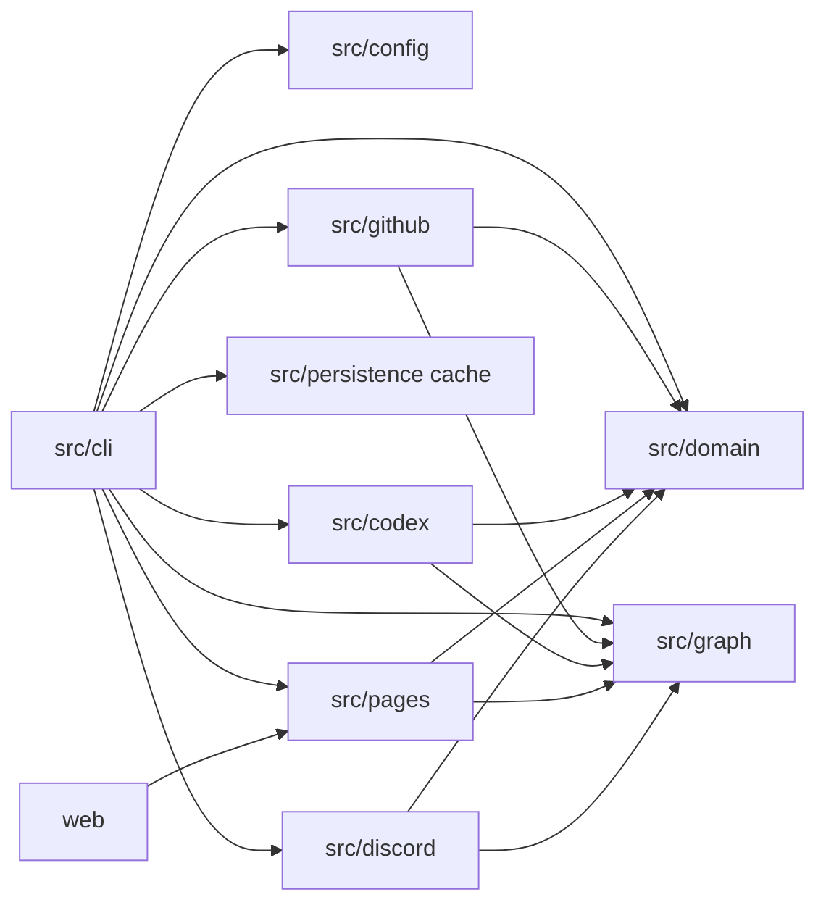

# アーキテクチャ

VOICEVOX Task Trackerは、GitHubの現在値と全timeline・編集履歴を取得し、発生時刻を再生して現在の評価を作る日次バッチです。
GitHubの確定情報を決定論的に評価し、自然言語の解釈が必要な候補だけをCodexへ渡します。
前回runの判定結果は正しさの入力にしません。cacheを削除しても、API取得量とAI実行量が増えるだけでcold runを再構築できます。

## モジュール境界

| モジュール        | 責務                                                                                   | 主な依存先                              |
| ----------------- | -------------------------------------------------------------------------------------- | --------------------------------------- |
| `src/config`      | YAMLの読み込み、Zod schema、意味検証                                                   | `src/domain`、`src/util`                |
| `src/github`      | GitHub Appの読み取り専用client、全ページ取得、公開allowlist、正規化、収集cache adapter | `src/config`、`src/domain`、`src/graph` |
| `src/domain`      | 状態機械、責務、停滞、severity、重要度、要対応度のpure判定                             | `src/util`                              |
| `src/graph`       | relation、dependency interval、cycle、frontier、downstream impactのpure判定            | `src/domain`                            |
| `src/codex`       | 候補選定、隔離実行、cache key、schema・semantic validation、importance fallback        | `src/domain`、`src/graph`               |
| `src/persistence` | canonical JSONとして4種類のcacheを読み書きするadapter                                  | `src/config`、`src/util`                |
| `src/pages`       | 独立した公開guard、公開DTO、gzip上限検査、Pages出力                                    | `src/domain`、`src/graph`               |
| `src/discord`     | 通知候補、固定周期判定、payload、Webhook送信                                           | `src/domain`、`src/graph`               |
| `src/cli`         | runの順序制御、artifact、job summary、各adapterの合成                                  | 上記の各adapter                         |
| `web`             | 公開DTOの検証、一覧、詳細、依存グラフ                                                  | `src/pages`のDTO契約                    |

`src/domain`と`src/graph`はネットワークやファイルシステムへ依存しません。
GitHub、Codex、cache、Pages、Discordの副作用はadapterに閉じ込め、pureな判定層から逆向きに呼び出しません。

## 日次runの順序

workflowはrun開始時に基準通知時刻`S`を固定します。日次scheduleの`S`は08:00 JSTに対応するworkflow入力であり、job開始時刻ではありません。
主処理は次の順に実行します。

1. `config.yml`をZodと意味検証で検証し、認証情報を必要なadapterだけへ渡します。
2. Organizationのrepository metadataを全ページ取得し、public、non-archived、non-disabledだけからrun内不変のallowlistを作ります。
3. allowlist内のopen IssueとPull Requestを全ページ列挙し、関係端点と終了項目の必要な範囲を求めます。
4. fingerprintが一致するGitHub収集cacheを候補として検証し、missはGitHubから現在値と全timeline、comment、review、edit historyを取得します。取得対象は`since`で切りません。
5. timelineのpagination順を保持し、発生時刻、item node ID、item内sequence、source IDで決定的に並べます。同時刻イベントはbatchとして扱い、途中状態による通知を作りません。
6. state、draft、assignee、review request、progress、responsibilityを項目ごとに再生します。stateやdraftはactor不明でも復元し、assigneeとreview requestの対象が不明な区間だけunknownにします。
7. native dependency、本文・comment由来のrelation mutationを再生して現在graph、newly unblocked、cycleの成立時刻を求めます。現在のblocks edgeは両端がopenのときだけactiveです。
8. 現在入力と完全一致するAI cacheを読み、missだけCodexへ渡します。出力はschemaとsemantic validationを通し、current graphに必要な結果が欠けた場合はrunを停止します。
9. 最終graphからimportance、attention、severityを計算し、`S`と発生時刻から通知候補を選びます。
10. 公開guardを通ったPages DTOと通知候補をworkflow artifactへ出します。
11. Pagesをdeployし、各schedule runの`github.run_attempt == 1`だけ、一回限りの変化と停滞の繰り返しを含む通常digestをDiscordへ送ります。`workflow_dispatch`とrerunでは通常digestを送りません。
12. PagesとDiscordの完了後に、新しいGitHub収集cacheとAI cacheだけをcanonical JSONで`tracker-state-v4`へ保存します。run reportはActions artifactとjob summaryへ保存します。

Pages、Discord、cache保存のいずれかで完全性または公開安全性を満たさない場合は、失敗として処理します。
cache保存を先に行わないため、公開に失敗した評価結果を次回の入力へ混ぜません。

## GitHub情報の再生

詳細取得は現在値だけで終了させず、状態区間を復元できる全イベントを取得します。

| 復元する値       | 主な入力                                                             |
| ---------------- | -------------------------------------------------------------------- |
| `statusSince`    | close、reopen、merge、draft、ready、check、commitなどのtimeline      |
| `ownerSince`     | assign、unassign、review request、comment、reviewのtimeline          |
| `stallSince`     | 現在status、責務epoch、meaningful progress、責務主体のhuman activity |
| `lastProgressAt` | commit、review、状態変更、対象label、検証済み自然言語progress        |
| current relation | native relation、本文・comment、現在入力に一致するAI結果             |
| newly unblocked  | blockerのclose・reopenとrelation追加・削除の時系列                   |
| cycle created    | relation追加・削除でcycleが初めて成立した時刻                        |

同じsource IDに異なる内容がある場合は例外です。eventのactorや相手Issueがnull、削除済み、取得不能でもイベント自体は捨てません。
意味を決められない範囲はunknown unionで返し、systemや現在時刻へ推測変換しません。
relation mutationの復元不能は現在graphを変更せず、影響する一回限り通知だけを抑止します。
実行時刻を状態変化時刻へ代用しません。

本文・commentのrelation候補は、編集差分、編集時刻、既存の検証済み入力から扱います。
`updatedAt`だけで追加・削除を断定しません。raw本文やraw diffはdomain、公開DTO、cacheへ保存しません。

## graphと終了項目

現在graphは現在のnative relation、現在本文・comment、現在有効なAI結果からだけ作ります。
blocks edgeは両端がopenのときだけactiveで、終了項目自身のdownstream impactと停滞通知は0です。
終了項目は`terminalAt`から180日までGitHub item cacheに保持してよく、期限後は削除します。
cacheに残る古い終了項目をopen項目の現在判定へ無条件に流用しません。

終了項目がreopenされた場合は、GitHubの現在値と全イベントでcacheを置き換えます。
終了項目cacheを全消去しても、現在openの項目とそこから参照される端点で重要なgraph、importance、attentionを再構築できます。

## 公開allowlistと機密データ停止

収集時に作ったallowlistは、cache保存前、Pages DTO生成前、Discord payload生成前に再検証します。
private、internal、archived、disabled、allowlist外のrepositoryまたは関連する機密データを一件でも検出したら、cache保存、Pages公開、通常Discordをすべて停止します。
取得対象から外れたデータを過去に公開されていたことだけを理由に残しません。

GitHub repository取得が503で失敗し、同じrepositoryの収集cacheが検証できる場合だけstaleとして使えます。
stale値は明示し、影響する通常通知から除外します。cacheがない503、503以外の失敗、不完全なページ取得はrunを失敗させ、Pagesと通常Discordを更新しません。

team member一覧は取得しません。`config.yml`のmaintainer名とGitHubが返すteam識別子だけを公開入力にします。
GitHub由来の本文、comment、label、ユーザー名はuntrusted dataとして扱い、命令やsecretとして解釈しません。

## Codexとcache

通常のAI結果のcache keyはmodel、reasoning effort、backend version、prompt version、schema version、deterministic rule version、normalized input hashから作ります。
同じ入力に完全一致するcacheだけを再利用し、run開始時刻だけの違いは入力に含めません。

今回のAIが失敗または延期した場合に限り、同じGitHub node IDの直近の検証済みimportanceを代替へ使えます。
latest fallbackの対象はsignificant feature、explicit deadline、future risk、rationaleだけです。
status、waitingOn、relation、progress、通知候補は過去入力から代替しません。
current graphに必要なrelation AIが欠けた場合は、古い入力の結果で補わずPagesと通常Discordを停止します。

## 重要度、要対応度、通知

importanceはlabel、downstream impact、milestoneと検証済みAI要因から計算し、attentionはimportanceとstallの既存式から毎run計算します。
terminal項目と`waiting_for_unblock`はattentionを0とします。severity、重要度、既存の閾値と表示理由は変更しません。

通知判定は保存済み送信状態を参照せず、`S`とGitHub由来の発生時刻で行います。
一回限りの通知は`S - 24時間 < T <= S`を満たす変化だけを候補にします。urgentは3日、criticalは2日の固定周期で閾値到達後に繰り返します。
各schedule runの`github.run_attempt == 1`だけ、一回限りの変化と停滞の繰り返しを含む通常digestを送り、`workflow_dispatch`とrerunでは通常digestを送りません。Webhookの通信断による極めて稀な重複は許容します。

## cache branchとartifact

`tracker-state-v4` branchの配置は次の4種類だけです。

| パス                         | 内容                                                               |
| ---------------------------- | ------------------------------------------------------------------ |
| `state/github-repositories`  | GitHub repository metadataとallowlist検証に使う収集cache           |
| `state/github-items`         | Issue、Pull Request、timeline、編集履歴を再取得するための収集cache |
| `state/ai-latest-importance` | nodeごとの直近検証済みimportanceだけを保持するcache                |
| `state/ai-results`           | content-addressedで一致入力のCodex結果を保持するcache              |

各pathはstate配下の正規化相対pathで、相互に同一または入れ子にしません。canonical JSONを使い、raw token、raw本文、raw diff、private repositoryの値は保存しません。
branchにはsnapshot、日次履歴、notification ledger、run reportを置きません。

Pages DTO、Discord payload、cache候補、allowlist診断、API・AI・stale件数はworkflow artifactへ出します。
run reportはActions artifactとjob summaryへだけ保存し、cache branchの判定入力にはしません。

## 性能と変更

cold runの受入条件は5,000 itemsと10,000 edgesを30分以内に処理することです。外部APIとCodexはmockし、paginationを含む全詳細取得と再生を測定します。

判定結果を変えるdomain、graph、prompt、schemaの変更では対応する規則versionとhash testの扱いを確認します。
cache配置、artifact、Pages、Discordのadapterを変更しても、pure判定へ副作用を持ち込みません。
