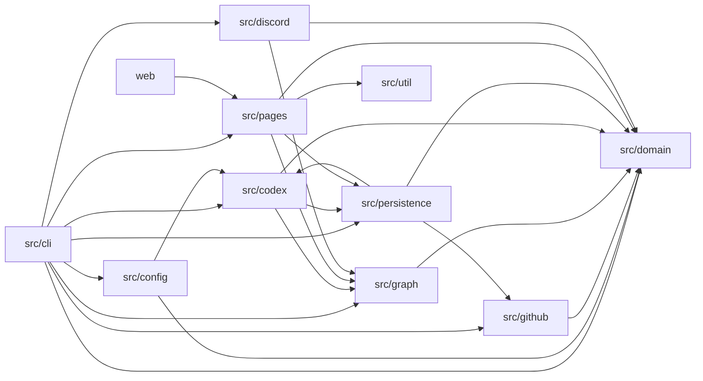

# アーキテクチャ

VOICEVOX Task Trackerは、GitHubから得た確定情報を決定論的に評価し、曖昧な自然言語だけをCodexで補う日次バッチです。
結果は型付き依存グラフと追跡stateへ集約し、GitHub PagesとDiscord向けの公開データへ変換します。

## モジュール境界

| モジュール        | 責務                                                                                     | 主な依存先                                               |
| ----------------- | ---------------------------------------------------------------------------------------- | -------------------------------------------------------- |
| `src/config`      | YAMLの読み込み、Zod schemaとsemantic validation                                          | `src/codex`、`src/domain`、`src/util`                    |
| `src/github`      | GitHub App認証、RESTとGraphQLの読み取り、公開allowlist、収集、正規化、rate limit管理     | `src/config`、`src/domain`                               |
| `src/domain`      | 状態機械、teamとlabel解決、追跡選定、停滞時間、severity、重要度、要対応度                | `src/util`                                               |
| `src/graph`       | 関係候補抽出、edge reconcile、cycle、frontier、downstream impact                         | `src/domain`                                             |
| `src/codex`       | 分析候補選定、予算、cache、隔離実行、schemaとsemantic validation、reducer                | `src/domain`、`src/graph`、`src/persistence`             |
| `src/persistence` | canonical JSON、snapshot、履歴、AI cache、通知ledger、run report、Git branch transaction | `src/codex`、`src/domain`、`src/github`                  |
| `src/pages`       | 独立した公開guard、公開DTO生成、gzip上限検査、JSON出力                                   | `src/domain`、`src/graph`、`src/persistence`、`src/util` |
| `src/discord`     | 通知候補選別、cooldown、payload分割、mention制限、Webhook送信                            | `src/domain`、`src/graph`                                |
| `src/eval`        | golden fixtureの解析と期待値比較                                                         | 判定、graph、公開DTO、通知の各pure処理                   |
| `src/performance` | 外部接続をモックした日次run全体の性能と予算の検証                                        | `src/cli`と全実処理モジュール                            |
| `src/cli`         | コマンド解析、日次トランザクション、実アダプターの合成、run report                       | 上記の全モジュール                                       |
| `web`             | 公開DTOの検証、要対応度と重要度を含む一覧と詳細、項目ごとの依存グラフ、検索、deep link   | `src/pages`のDTO契約                                     |

`src/domain`と`src/graph`はネットワークとファイルシステムへ依存しません。
副作用を持つモジュールがpureな判定を呼び出し、pureな判定からGitHub、Codex、Git、Pages、Discordを呼び出す逆向きの依存は作りません。
`src/cli`だけが実アダプターを組み合わせて一つのrunにします。



## 日次run

`pnpm tracker:run`はworkflow向けサブコマンドを検証し、変換せず既存CLIへ渡します。
option形式の引数は`--backfill`に従って`daily`または`backfill`へ変換し、`DailyTransactionRunner`へ渡します。
日次トランザクションは次の順で進みます。

1. `config.yml`を検証し、必要な環境変数だけを読み取ります。
2. `tracker-state` branchのsnapshotと通知ledgerを同じrevisionから読み取ります。
3. GitHub Appのinstallation tokenを発行し、期限前に更新できる読み取り専用clientを作ります。
4. Organizationのrepository metadataを全ページ取得し、run中に不変な公開allowlistを作ります。
5. 設定したteamを解決し、allowlist内repositoryのopen IssueとPull Requestを列挙して詳細を収集します。前回の`aiAnalysis.status`が`failed`か`deferred`の項目は、GitHub側の変化にかかわらず詳細を収集します。収集した詳細から関係先を抽出し、まだ取得していないOrganization内の関係先を識別子指定で個別列挙して収集結果へ統合します。追加した詳細から関係先を再び抽出し、対象がなくなるまで同じrun内で繰り返します。native relationは設定した深度まで、参照は追跡根から1 hopだけ辿ります。
6. GitHubイベントをsource ID付きに正規化し、追跡対象と関係候補を選びます。Pull Request作成前のcommitは作成時刻を下限としてpushイベント化し、項目作成前のイベントを作りません。
7. IssueとPull Requestの状態と責務を決定論的に判定します。
8. 高信頼で確定しない項目をCodexで分析し、出力を検証します。前回のAI分析が失敗または延期した項目は、GitHub側の変化にかかわらず分析対象を再選定します。
9. reducerの第1 pass、暫定graphのreconcileと解析、graphを反映したreducerの第2 pass、最終graphのreconcileと解析の順に実行し、停滞時間、cycle、frontier、downstream impactを確定して重要度と要対応度を計算します。
10. snapshotと通知候補を作り、完全性と公開安全性を検証します。
11. `daily`と`backfill`では検証済みstateをatomic commitし、Pages用DTOを書き出してDiscord送信を実行します。完了時に実測時刻と送信結果を反映したrun reportとledgerを追加commitし、`tracking.startAt`が未確定なら同じcommitで確定します。
12. 成功、Codex縮退、失敗のいずれでもCLIのreport pathへrun reportを書き出します。

`dry-run`は手順10まで実行し、state、Pages、Discordを変更せずに検証済みartifactとrun reportだけを書き出します。
Codexの失敗は決定論的判定へ縮退できるため、完全性を満たす場合は`fallback`として後続処理を続けます。
snapshotはAIの有効状態、利用可否、縮退状態をrun statusと別に保存します。
`available`は検証済みのAI分析結果を1件以上利用できたことを表します。分析対象がなく失敗も延期もないrunも`available`です。
`degraded`は失敗または延期が1件以上あることを表します。利用できた結果が1件もなければ`available`は`false`になります。
PagesはこのAI状態を公開DTOへ変換し、run statusからAIの状態を推定しません。
repository単位の収集は、再試行後も503で失敗し、同じrepositoryの前回値がある場合だけ前回値を`stale`として使います。
この縮退はdiagnosticとstale件数を記録して後続処理を続け、run statusを変更しません。
前回値がない503、503以外の例外、不完全な結果は`failure`となり、通常の後続stageを実行しません。
反復を終えても端点を取得できなかった関係候補は追跡選定へ渡さず、除外した件数をdiagnosticへ記録します。
GitHubの`closingIssuesReferences`とtimelineの`willCloseTarget`はauthoritativeな`implements`関係として確定します。
本文のclosing keywordだけから得た`implements`候補は推定のままです。

`.github/workflows/daily.yml`は通常経路の`test-eval`、`collect-analyze`、`persist-state`、`build-pages`、`deploy-pages`、`notify-discord`に、失敗時だけ動く`notify-operations`と全job結果を保存する`report-workflow`を加えた8 jobで構成されています。
`collect-analyze`は`CODEX_AUTH_JSON`をrunnerの一時directoryへ配置し、配置直後の`auth.json`のsha256を指紋として保存します。
配置直後とsecretへ書き戻す直前に、`auth.json`内のすべての文字列値を行へ分け、16文字以上の各行を`::add-mask::`へ登録します。
値に含まれる`%`はworkflow commandへ渡す前に`%25`へescapeします。
個々のtokenは`CODEX_AUTH_JSON`の部分文字列であり、更新後の認証ファイルもjob開始時のsecretとは異なるため、Actionsの自動マスクには依存しません。
Codex CLIはaccess tokenの残り有効期間が5分未満になるとrefresh tokenで更新し、rotation後の認証情報を`auth.json`へ保存します。
配置stepが成功していれば、先行stepの成否を問わず配置時の指紋と現在値を比較し、変更された場合だけ`CODEX_AUTH_JSON`へ書き戻します。
書き戻しにはこのrepositoryだけを対象とし、repository permissionsを`Secrets`のRead and writeだけにした`CODEX_AUTH_SYNC_TOKEN`を使います。
`CODEX_AUTH_SYNC_TOKEN`は書き戻しstepだけへ渡します。
jobの最後は成否を問わず`codex-home`と指紋ファイルを削除します。
各jobは`contents`、`pages`、`id-token`を必要な範囲だけ要求し、secretを使うjobはdefault branchのscheduleと手動実行に限定しています。
`report-workflow`は収集時のCLI reportと各jobの結果をActions artifactへ保存するだけで、stateとPagesを変更しません。
現在のActions統合上の制約は[デプロイ手順](DEPLOYMENT.md)に記載しています。

## 重要度の計算

重要度は`src/domain`のpureな判定で計算します。
停滞の深刻さを表すseverityとは独立した値です。
`src/cli`は最終graphの解析後に必要な入力を集めて`src/domain`へ渡し、Codexやgraphがscoreとlevelを直接決めることはありません。

| 入力                      | 依存する情報                                                               |
| ------------------------- | -------------------------------------------------------------------------- |
| 優先度ラベルの重み        | 現在のラベルと`labels.rules`                                               |
| downstream impact         | 最終graphが算出した停止中のopen項目数とリポジトリ数                        |
| 期限付きのopen milestone  | GitHubから正規化したmilestone、run開始時刻、`importance.dueSoonDays`       |
| Codex由来の3要因          | schema検証とsemantic検証を通った重要な機能、明示された期限、将来問題の判定 |
| 各要因の重みとlevelの閾値 | `config.yml`の`importance.weights`と`importance.levels`                    |

Codex由来の3要因はconfidenceがmedium以上の場合だけ加点します。
そのrunで利用できる判定がない項目は前回snapshotの判定を再利用し、前回判定もなければ決定論的な要因だけを使います。
優先度ラベル、downstream impact、milestoneの決定論的な要因は現在の入力から毎run計算します。
`src/domain`は要因の加点を0から100の整数へ収め、設定した閾値からlow、medium、highを決めます。

## 要対応度の計算

要対応度は`src/domain`のpureな判定で、重要度を主、停滞の短さを従として計算します。
停滞が長い項目は対応が不要だった場合が多いという前提に立ち、重要度が低いまま最近動いただけの項目を上位へ置きません。

```text
鮮度係数 = recencyFloor + (1 - recencyFloor) × 0.5 ^ (停滞時間 ÷ watch閾値)
要対応度スコア = round(重要度スコア × 鮮度係数)
```

停滞時間は`stallSince`からrun開始時刻までの経過時間です。
watch閾値は項目のwait classに対応する`staleness.thresholdsHours`の`watch`で、鮮度係数の半減期として使います。
`attention.recencyFloor`の既定値は0.4で、停滞が伸びても要対応度は重要度の0.4倍までしか下がりません。
scoreは0から100の整数で、`attention.levels`の閾値からlow、medium、highを決めます。
既定の下限はhighが40、mediumが20です。
terminal項目と`waiting_for_unblock`の項目は、自身が動けないためscoreを0にします。

要対応度はGitHub側の変更有無にかかわらず、最新の重要度、停滞時間、設定から毎run全項目で再計算します。
Codexとgraphは要対応度のscoreとlevelを直接決めません。

## 判定規則の変更と再判定

増分収集はGitHub由来の項目fingerprintが前回と一致する項目の詳細取得を省きます。
詳細を取得しない項目は状態機械へ渡らず、前回snapshotの判定結果をそのまま引き継ぎます。
このままでは判定規則を変えても、GitHub側が動いていない項目の判定が古いまま残ります。

そのため、項目ごとに判定規則fingerprintをsnapshotへ保存し、現在値と異なる項目を詳細取得の対象へ加えます。
判定規則fingerprintは項目種別に対応する決定論的規則versionと、Codex実行identityのhashから作ります。
Issueの規則だけを変えた場合はIssueだけが再取得され、modelやprompt versionを変えた場合は全項目が再取得されます。

判定規則fingerprintを現在値で保存するのは、そのrunで実際に再判定した項目だけです。
再判定していない項目に現在値を書くと、古い判定のまま最新規則で判定済みと記録され、以後再判定されなくなります。
検査するのは前回snapshotに判定結果を持つ項目だけです。追跡対象外の列挙項目には引き継ぐ判定がないため、毎回の再取得を避けます。

前回の`aiAnalysis.status`が`failed`か`deferred`の項目も、GitHub側の変化と判定規則fingerprintにかかわらず詳細取得の対象へ加えます。
AI分析の失敗と延期はGitHub側を動かさないため、この扱いがなければ縮退した判定が固着します。
terminal項目も同じ扱いにし、次回runで必ずAI分析を再試行します。

決定論的規則versionとprompt versionは手で更新する定数です。
`tests/rules-version-hash.test.ts`が判定に関わるファイルの内容hashを記録しており、
判定ロジックやプロンプトを変えるとテストが失敗してversionの更新要否を判断させます。

要対応度は前回の判定結果を引き継がず毎run全項目で再計算するため、要対応度だけの変更ではIssueとPull Requestの決定論的規則versionを上げません。

初回に判定する項目と、判定規則の変更で再判定する項目は、timelineを`since`なしの全履歴で取得します。
停滞起点はtimelineイベントの再生から決めるため、過去のイベントが見えていないと下限まで落ちてしまいます。
GitHubの`updated_at`が進んだだけの項目は、前回の停滞起点を引き継ぐので増分窓のままにします。

## 停滞起点の決定論性

停滞起点`stallSince`はGitHub由来の時刻だけから決めます。
走査した時刻も、過去に何度走査したかも、起点には影響しません。
同じGitHubデータなら、いつ走査しても同じ停滞時間になります。

状態機械は、現在の状態が始まった時点をtimelineイベントの再生で求めます。
担当区間はassignとunassign、draft区間はdraft変換とready for review、
merge queue区間は追加と削除、ラベル区間は付与と削除をそれぞれ時系列で再生します。

GitHubが時刻を持たない場面では、決定論的に決まる下限を使います。

| 場面                      | 下限                                 |
| ------------------------- | ------------------------------------ |
| 区間の開始イベントが無い  | 項目の作成時刻                       |
| native dependencyの成立   | 関係の両端の作成時刻のうち遅い方     |
| conflictやmerge可能の成立 | head commitのpush時刻                |
| Codex由来の判定           | 判定根拠となったsourceの時刻の最大値 |

遷移根拠の`precision`はこの区別を表します。
`event`はGitHubのイベント時刻そのもの、`inferred`はGitHub由来の時刻から導いた下限です。

停滞起点は一度確定するとstateへ保存し、statusと責務が変わるまで引き継ぎます。
起点からrun開始時刻までの経過時間を毎回求め直し、severityと要対応度の算出に使います。

停滞起点には、現在の待ち先本人がGitHub上で活動した時刻も下限として効きます。
待ち先がuserならそのアカウント、teamなら設定済みteamのmemberが対象です。
第三者やbotの活動、draft戻しやmerge queueの出し入れは対象外で、停滞を解除しません。
待ち先本人が動いていない項目は作成時刻まで下限が落ち、長い停滞として残ります。

人間コメントを意味のある進捗と認めるかはCodexの判定に委ねているため、
AI判定を行わなかった項目では`lastProgressAt`が作成時刻のままになります。
待ち先本人の活動を下限に加えることで、AI判定の有無によらず停滞時間が決まります。

関係edgeが成立した時刻は、根拠となったsourceの発生時刻のうち最も古いものにします。
同じcommitを複数のPull Requestが含む場合、commitのsource IDは共有される一方で、
発生時刻はそれぞれのPull Request作成時刻を下限に補正されるため食い違います。
最も古い時刻はsourceの集合だけで決まるので、収集した項目の順番が変わっても同じ値になります。

## 公開DTOとWeb UI

`src/pages`はsnapshotの各項目を`PublicItemSummaryDto`へ変換し、重要度に加えて要対応度のscoreとlevelを`attention`へ格納します。
summaryとdetailsは同じ項目summaryを持ち、Web UIは両者の一致を検証します。

項目一覧と担当者ごとのページは要対応度、重要度、停滞時間の三つだけを並び替えキーとし、既定は要対応度の降順です。
repository、種別、状態、重要度、次の担当、停滞時間、AI利用状況による絞り込みは項目一覧で独立して適用します。
`failed`と`deferred`は項目一覧へ警告アイコンを表示し、項目詳細でも警告として表示します。
`not_required`は警告アイコンを表示せず、項目詳細では警告ではない情報として区別します。
項目一覧のAI利用状況は、AI推定が最新でない項目とAI推定を省いた項目を別々に絞り込みます。
Web UIはseverityを表示、絞り込み、並び替え、依存グラフのnode選定に使いません。

公開summaryの依存グラフは要対応度を最初の優先順位として初期nodeを選びます。
項目詳細の依存グラフは中心項目を必ず残し、表示上限内の候補をfrontier、要対応度の順で優先します。
残りの同順位はdownstream impact、停滞時間、node IDなどの決定論的なキーで解決します。

## 公開境界の三重guard

公開境界は一つのfilterへ依存せず、三つの段階で検証します。

1. 収集guardはrepository metadataだけを先に取得し、`public`、非アーカイブ、非disabledを満たすrepository IDをallowlistへ固定します。Organization外の参照先は詳細応答で`public`を検証し、関係候補の解決時にarchive済みとdisabledを除外します。
2. 永続化guardはcommit直前にsnapshotと付随データを走査し、allowlist外ID、private repositoryのID、owner/name、repository URL、既知secret、credential field、不要な全文を拒否します。
3. Pages guardはDTO生成直前に別実装で収集時の公開allowlistとsnapshotを照合し、repository identity、private sentinel、secret、安全でないURL、不要な全文を再検査します。

収集時の公開allowlistはworkflow artifactへ保存し、Pages guardではsnapshotから再構築しません。
artifactには照合に必要なrepository ID、owner、nameだけを保存します。

guard違反は例外として日次トランザクションへ伝播します。
新しいPages公開と通常digestは実行されず、最後に成功した公開結果が残ります。
Pages guardを含むPages stageのエラーでは、通常digestの代わりにDiscordへ運用障害通知を試みます。
通常digestにはPages guardを通過したsnapshot由来の通知候補だけを使います。
通常digestの送信前には、artifactのsnapshotとtracker-state branchへ永続化済みのsnapshotでrun IDが一致することを検証し、不一致なら送信せず失敗します。

## Codexの隔離

本番経路は前回成功したCodex分析のfingerprintをsnapshotの収集項目へ保存し、次回の候補選別へ渡します。
GitHubの確定情報で高信頼に解決した項目に加え、入力hash、隣接graph hash、実行identity hashが前回と一致する項目も除外します。
未変更候補はcontent-addressed cacheの検証済み結果をreducerへ渡し、変更候補も同じ判定入力が保存済みならcacheから再利用します。
どちらの場合もcache hitではCodex processを実行しません。
判定規則version、model、reasoning effort、backend version、prompt version、schema version、入力hashからcache keyを作り、同一入力だけを再利用します。
このcache再利用と重要度の前回判定利用は別の規則です。
そのrunで利用できる重要度判定がない場合は、前回の判定を現在の決定論的な要因と組み合わせます。
Codex入力の判定時刻は未来のsource参照を拒否するsemantic検証にだけ使い、時間依存の状態と停滞時間は決定論的処理で算出します。
判定時刻を入力hashから除外するため、run開始時刻だけが異なる入力は同じcache keyになります。
call数、入力文字数、推定費用の上限を超えた候補を優先順位に従って延期できる設計です。
本番経路は実入力から推定費用を算出し、blocker変化と前回graphのdownstream impactを予算不足時の優先順位へ反映します。

予算計画で選ばれた候補は`ai.execution.maxConcurrentCalls`件まで同時に実行します。
判定結果と失敗の並びは完了順ではなく予算計画順へ再構成するため、並列度を変えてもrun reportとstateのbyte列は変わりません。
実行中に予期しない例外が出た場合は新しい候補の実行を始めず、実行中の候補の完了を待ってから例外を伝播します。

実行時は空の一時directoryを作り、`codex exec`へ次の制約を渡します。

- `read-only` sandbox
- approval policy `never`
- `ai.execution.reasoningEffort`で指定したmodel reasoning effort
- ephemeral実行
- user configとrulesの無視
- Git repository検査の無効化
- 固定system prompt
- repository内JSON Schemaによる最終出力の拘束

現行の`config.yml`は`ai.authentication: auth-json`を指定します。
`ai.authentication: api-key`ではsubprocessへ`HOME`、`OPENAI_API_KEY`、`PATH`だけを渡します。
`ai.authentication: auth-json`では`CODEX_HOME`、`HOME`、`PATH`だけを渡し、起動前に`CODEX_HOME`直下の`auth.json`がファイルとして存在することを確認します。
アプリケーション側のCodex認証providerは`auth.json`の存在だけを確認し、内容を読みません。
GitHub App private key、installation token、Discord Webhook URL、`CODEX_AUTH_SYNC_TOKEN`は渡しません。
Issue本文、コメント、ラベル、loginはID付きの信頼できない入力データとして渡し、命令として扱いません。
`deterministicSignals`にはnative relation候補のIDを`nativeBlockedBy`、`nativeBlocking`、`nativeParent`、`nativeSubIssues`へ分けて渡します。

Codexのtimeout、rate limit、不正JSON、一時的なprocess起動失敗、signal終了は`ai.execution.maxAttempts`まで再試行します。
待機時間は`operations.retry`の初期待機時間と最大待機時間を使い、指数backoffとjitterを適用します。
非ゼロ終了、固定資材や設定の不備、恒久的なprocess起動失敗は再試行しません。
Discordはtransport例外とHTTP 429、503だけを同じ設定で再試行し、他のHTTP status、secret不備、成功応答のschema不正は直ちに失敗します。

Codex出力はJSON Schema検証の後にsemantic validationを通します。
入力にないsource ID、user、team、relation targetは拒否し、native relationは変更させません。
`prompts/codex-system.md`の出力制約は同じsemantic validation規則をAIへ明示し、現行の`ai.promptVersion`は`v6`です。
検証済み出力も候補データであり、reducerを通さずstateや外部サービスへ反映しません。

## state branch

`main`にはsource、設定、schema、prompt、Web UI、テスト、文書を置きます。
日次stateはorphan branchの`tracker-state`へcanonical JSONとして保存し、外部databaseは使いません。

| 既定パス                            | 内容                                                                                         |
| ----------------------------------- | -------------------------------------------------------------------------------------------- |
| `state/snapshot.json`               | 要対応度、AI状態、項目ごとのAI利用状況、tracking.startAtを含むschema version 8の最新snapshot |
| `state/history/YYYY-MM-DD.jsonl`    | 前回snapshotとの差分を持つ日次履歴                                                           |
| `state/ai-cache/<sha256>.json`      | Codexのcontent-addressed cache                                                               |
| `state/notification-ledger.json`    | 予約期限、送信結果、cooldownを持つ通知ledger                                                 |
| `state/run-reports/YYYY-MM-DD.json` | PagesとDiscordの完了後に保存するsuccessまたはfallbackの実績指標と診断                        |

追跡項目の`aiAnalysis.status`は次の利用状況を表します。

| status         | 意味                                               |
| -------------- | -------------------------------------------------- |
| `used`         | 検証済みのAI分析結果を利用した                     |
| `failed`       | AI分析の実行または出力検証に失敗した               |
| `deferred`     | run予算によりAI分析を延期した                      |
| `not_required` | 決定論的判定だけで確定し、AI分析を必要としなかった |
| `disabled`     | 設定でAI分析が無効だった                           |
| `not_recorded` | 項目単位のAI利用状況が記録されていない             |

`used`のcache keyはsnapshotだけへ保存します。
Pagesのsummaryとdetailsには全statusを公開し、cache keyは公開しません。

永続化sessionはbranch headを開始時に固定し、snapshot、履歴、追加cache、通知候補選別後のledgerを通常stateの最初のGit commitへまとめます。
通知予約はrun開始時刻から24時間だけ有効です。
予約期限は日次workflow内の排他用leaseであり通知方針ではないため、設定項目にせず日次周期と同じ24時間へ固定します。
期限内の予約は重複送信を抑え、期限切れの予約は次回の候補選別で抑制しません。
cooldownと同日抑制は送信済みentryだけへ適用します。
run reportはDiscord送信結果が確定してから、実送信数と完了時刻を含めて保存します。
初回の通常state commitでは、未指定の`tracking.startAt`を`not_fixed`のまま保存します。
PagesとDiscordが完了した場合だけ、`resolveTrackingStartAt`で完全成功時刻を確定します。
この確定値、送信結果を反映したledger、run reportは2回目のGit commitで一緒に保存します。
`tracking.startAt`が確定済みのrunでも、送信結果を反映したledgerとrun reportを2回目のGit commitで保存します。
各commitの前にheadが変わった場合は競合として失敗し、不完全なcommitへ切り替えません。
GitHub Pagesはbranchを公開元にせず、ActionsのPages artifactからdeployします。
